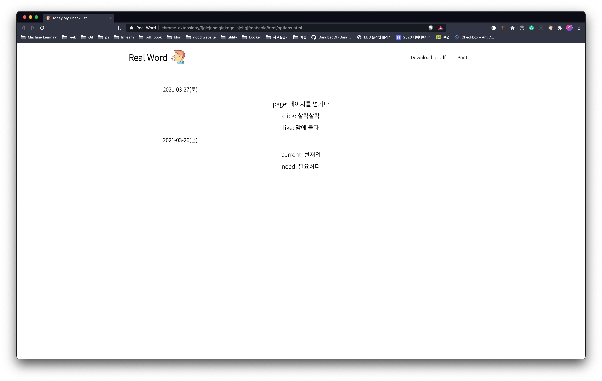
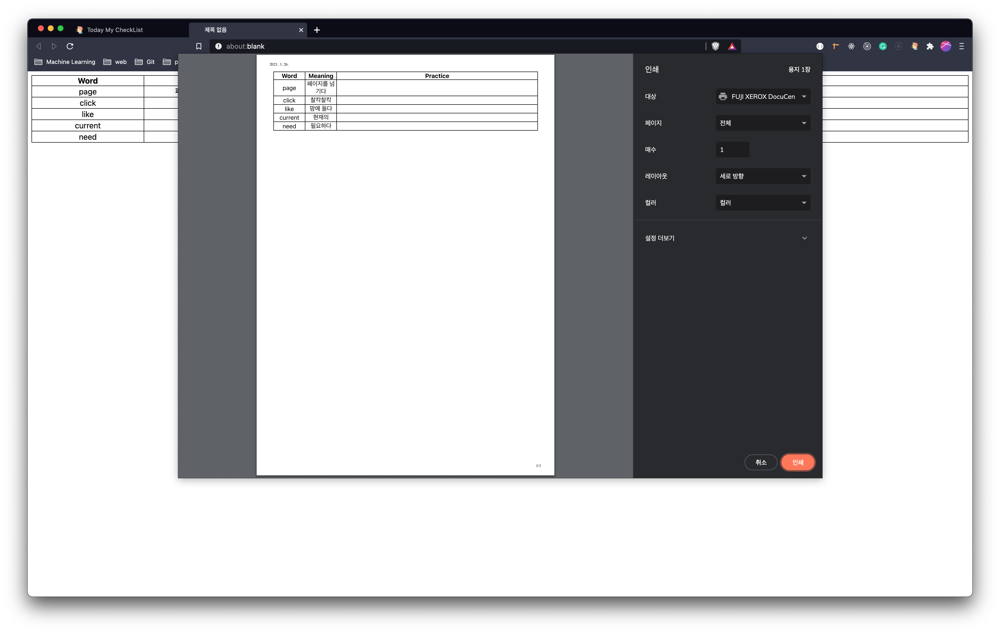
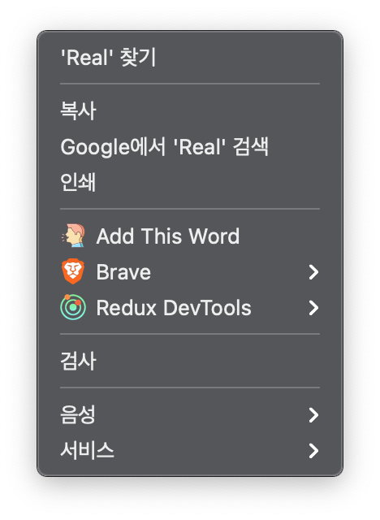
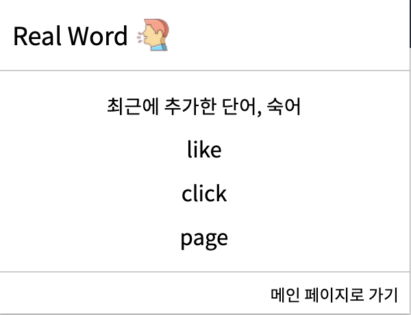

# real-word

[Notion Link ✈](https://www.notion.so/Gangyeon-Jo-s-Portfolio-07db7894fda84255953a50945709f046?p=2f8e750730e444dd815bc6ea46b5553b)

  
  
  
  

 

## Tech Stack

-   **프론트엔드**
    -   JavaScript
    -   HTML5
    -   CSS3
-   **백엔드**
    -   Node.js
        -   Express.js
-   **API**
    -   Naver Papago NMT
    -   Chrome Context Menu
    -   Chrome Storage
